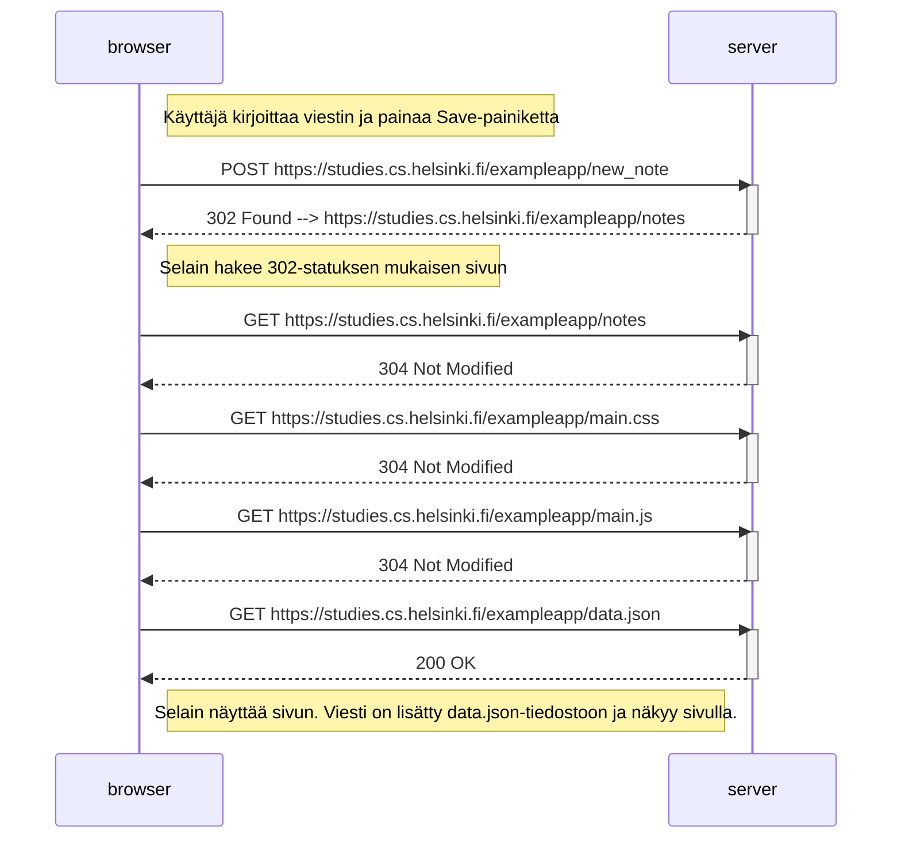

```mermaid
sequenceDiagram
    participant browser
    participant server

    note right of browser: Käyttäjä kirjoittaa viestin ja painaa Save-painiketta
    browser->>server: POST https://studies.cs.helsinki.fi/exampleapp/new_note
    activate server
    server-->>browser: 302 Found --> https://studies.cs.helsinki.fi/exampleapp/notes
    deactivate server

    note right of browser: Selain hakee 302-statuksen mukaisen sivun
    browser->>server: GET https://studies.cs.helsinki.fi/exampleapp/notes
    activate server
    server-->>browser: 304 Not Modified
    deactivate server

    browser->>server: GET https://studies.cs.helsinki.fi/exampleapp/main.css
    activate server
    server-->>browser: 304 Not Modified
    deactivate server

    browser->>server: GET https://studies.cs.helsinki.fi/exampleapp/main.js
    activate server
    server-->>browser: 304 Not Modified
    deactivate server

    browser->>server: GET https://studies.cs.helsinki.fi/exampleapp/data.json
    activate server
    server-->>browser: 200 OK
    deactivate server
    note right of browser: Selain näyttää sivun. Viesti on lisätty data.json-tiedostoon ja näkyy sivulla.
```
