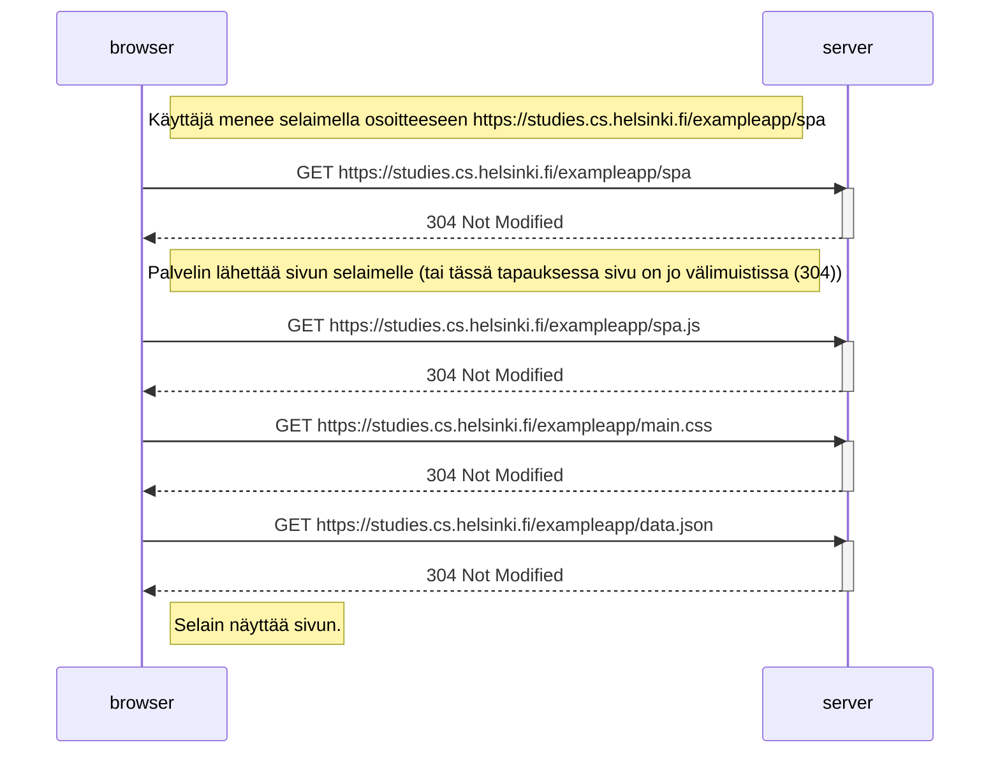

```mermaid
sequenceDiagram
    participant browser
    participant server

    note right of browser: Käyttäjä menee selaimella osoitteeseen https://studies.cs.helsinki.fi/exampleapp/spa
    browser->>server: GET https://studies.cs.helsinki.fi/exampleapp/spa
    activate server
    server-->>browser: 304 Not Modified
    deactivate server
    note left of server: Palvelin lähettää sivun selaimelle (tai tässä tapauksessa sivu on jo välimuistissa (304))

    browser->>server: GET https://studies.cs.helsinki.fi/exampleapp/spa.js
    activate server
    server-->>browser: 304 Not Modified
    deactivate server

    browser->>server: GET https://studies.cs.helsinki.fi/exampleapp/main.css
    activate server
    server-->>browser: 304 Not Modified
    deactivate server

    browser->>server: GET https://studies.cs.helsinki.fi/exampleapp/data.json
    activate server
    server-->>browser: 304 Not Modified
    deactivate server
    note right of browser: Selain näyttää sivun.
```
