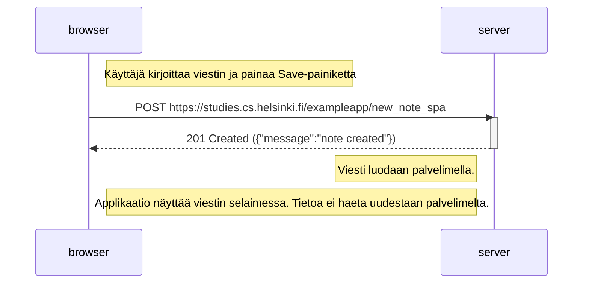

```mermaid
sequenceDiagram
    participant browser
    participant server

    note right of browser: Käyttäjä kirjoittaa viestin ja painaa Save-painiketta
    browser->>server: POST https://studies.cs.helsinki.fi/exampleapp/new_note_spa
    activate server
    server-->>browser: 201 Created ({"message":"note created"})
    deactivate server
    note left of server: Viesti luodaan palvelimella.
    note right of browser: Applikaatio näyttää viestin selaimessa. Tietoa ei haeta uudestaan palvelimelta. 

```
